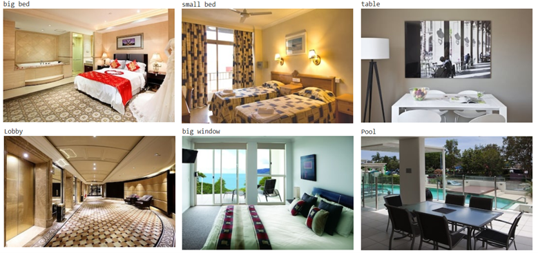
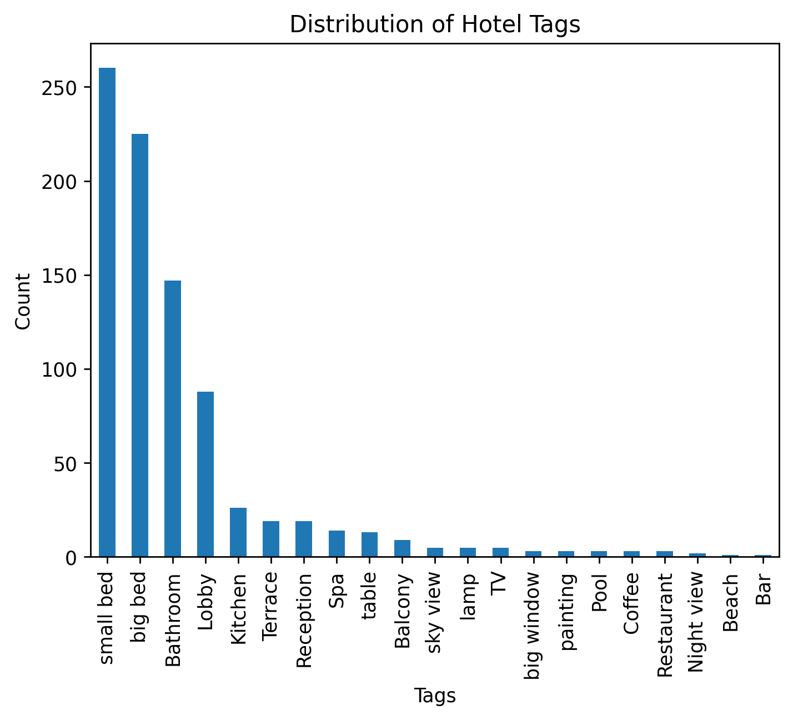
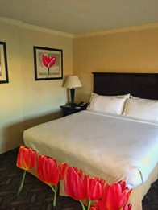

# sirius_ml
Вступительное задание в Сириус
### Образ и предпочтения инопланетян 
Инопланетяне, с которыми мы работаем, обладают большими вытянутыми глазами, при этом у них есть возможность воспринимать широкий спектр световых волн, включая ультрафиолет и инфракрасный диапазоны. Эти характеристики влияют на их предпочтения в отеле и восприятие изображений. 
Предпочтения в выборе отеля: Инопланетяне ценят просторные и уединенные отели, которые предлагают открытое небо или большие окна для наблюдения звезд. Также они любят, когда на кровати лежат тюльпаны или в номере висят картины с ними. Кроме того, они любят пить кофе из больших кружек и могут любить бассейны.
Ниже приведены изображения типичных инопланетян, сгенерированных с помощью stable-diffusion-xl-base-1.0 
 
 
 
 
 
## Изучение датасета 
### Тема и проблематика 
1. Что такое Image Captioning? 
Image Captioning – это процесс автоматического генерирования текстового описания изображения. Процесс обычно включает в себя два основных компонента: компонент для извлечения признаков изображения, обычно с помощью сверточных нейронных сетей, и компонент для формирования описания, обычно с помощью рекуррентных нейронных сетей. 
2. Почему над этим работают? 
Работа над автоматическим описанием изображений (image captioning) ведется по нескольким причинам. Во-первых, это способ сделать контент более доступным для людей с нарушениями зрения. Во-вторых, это инструмент для создания более эффективных поисковых систем. Также это улучшает взаимодействие между человеком и машиной, поскольку позволяет компьютерам понимать контекст изображений. 
3. Как формулируется задача? Задача Image Captioning формулируется как задача машинного обучения, особенно в контексте глубокого обучения. Вводными данными служит изображение, а выходными данными - описание изображения в форме текста. Сначала модель обучается на большом наборе данных, состоящем из изображений и их соответствующих описаний. Затем модель используется для генерации описаний новых изображений. Важным аспектом обучения таких моделей является подбор функции потерь, которая могла бы точно отразить качество сгенерированных описаний. 

### Обзор датасета 
1. Что представлено на изображениях? 
Изображения в датасете Hotels-50K представляют собой фотографии отелей со всего мира. Снимки сделаны как на профессиональную камеру для публикации на туристических сайтах, так и на камеры мобильных телефонов обычными путешественниками. Изображения содержат разнообразные виды интерьеров отелей, включая ванную комнату, спальню и общие зоны. 
2. Сколько объектов в датасете? Сколько уникальных классов? Сбалансирован ли датасет? 
Датасет включает более 1 миллиона изображений от 50 000 различных отелей и 92 крупных сетей отелей. Также в обучающем наборе содержится 55 061 изображений, предоставленных пользователями через мобильное приложение TraffickCam. Тестовый датасет включает 17 954 изображений от 5 000 различных отелей. Классы в датасете, не сбалансированы, поскольку некоторые отели представлены большим количеством изображений, в то время как другие - меньшим. 
3. Какие параметры у изображений? Размер фотографий?
 Датасет не указывает конкретные параметры изображений, такие как размер фотографий или их разрешение. Однако, изображения могут иметь различные размеры и разрешения, поскольку они были получены из различных источников, включая профессиональные фотографии с туристических сайтов и снимки с камер мобильных телефонов обычных путешественников.

## Обогащение датасета описаниями
В качестве тренировочной выборки были взяты 866 изображений, которые были доступны по указанным в датасете ссылкам. В эти изображения входят как фотографии номеров отелей, ванных комнат, балконов, лобби и т.д. Обычно при работе с изображениями необходимо производить их предобработку: масштабирование, нормализацию, преобразование в тензоры, центрирование по интенсивности пикселей; она выполняется автоматически при использовании модели CLIP [https://huggingface.co/docs/transformers/model_doc/clip]. Также при обучении моделей важным этапом является аугментация, в нашем же случае она не нужна, так как мы используем модель на инференсе. 
Перед работой с моделью CLIP, необходимо составить возможные тэги, присутствующие на картинке. Для фотографий отелей были взяты основные тэги как: TV, lamp, big bed, table, sky view и некоторые другие тэги, присущие отелям. Выходом модели являются скоры сходства между фото и тэгами, с которыми после функции softmax можно работать как с вероятностями.  Далее есть несколько вариантов работы: присвоить каждой фотографии хоть один тэг (у которого максимальная вероятность) или присваивать тэги при значении большем порогового (например, 0.3). Я решил остановиться на первом варианте, при котором каждая фотография получит свой тэг, что увеличит возможность выбора отелей и номеров для инопланетян.

Примеры полученных тэгов:\
 ]
 
Просмотрев «глазами» все полученные результаты, можно сделать вывод, что почти во всех случаях тэг выставляется корректно. Если же на картинке находится несколько объектов, соответствующих тэгам, то чаще всего выставляется тэг объекта большего размера, обычно это кровати. В целом, если мы хотим добавить тэги конкретных предметов, можно попробовать использовать clip без самых популярных тэгов. 

Гистограмма распределения тэгов:\
 
 
Теперь сделаем кластеризацию по тегам. Можно видеть, что кластеров оказалось меньше, чем тэгов, 27 против 22. Это связано с тем, что несколько некоторые тэги не нашлись не на одной из картинок. В остальном количество кластеров сошлось с количеством классов. По моему мнению проводить кластеризацию имеет смысл с большими описаниями, а не и тэгами размерностью в 1-2 слова, кроме того количество тэгов должно быть достаточно большим.

## Изменение изображения при помощи диффузионной модели
Сначала я составил выборку из 5 различных по наполнению фотографий с которыми дальше работал, сюда вошли фото с большим окном, фото с балкона, фото с кроватью, фото с официантом и наконец фото со столиком.

Для изменения фотографий я использовал модель instruct-pix2pix [https://huggingface.co/timbrooks/instruct-pix2pix]. Далее слева находится оригинал, а справа измененные фотографии отелей, также указан prompt-запрос.

         
Prompt: change to night\
Prompt:  starlight night
Достаточно хорошо получилось с изменением времени суток из окна.\
Видно, что здания остались на своем месте, правда на средней фото почему-то поменялась планировка и убралась картина.\
\
             
Prompt: change to night\
Prompt: starry night\
С заменой дня на ночь сетка спралвяется хорошо, а вот при добавлении звездного неба пропала часть дома, а возможно она просто «засветилась», когда была сделана эта «фотография».

           
Prompt: replace painting with tulip painting\
Prompt: paint bed linen pink
\
Получилось неплохо с заменой картины на фото тюльпана, но кроме того тюльпаны добавились и на часть постельного белья внизу кровати. Будем считать, что это такой дизайн.
Со вторым запросом получилось тоже интересно. Кроме постельного белья окрасилась и лампа.

\
  

Prompt: replace food with a coffee
\
Заменили булочки на кофе, ведь инопланетяне его любят! Правда у официанта теперь чтото с рукой…  
\
         
Prompt: add coffee on table \
Prompt: add tulips on table 

Добавили на стол чашечку кофе и тюльпанов. Кроме стола тюльпаны появились и на картине, а еще и справа вместо кресла. Но что поделать, если пришельцы их любят.\
Были приведены наиболее удачные результаты. Часто изображения размазывались, удалялись имеющиеся детали, а иногда не оставалось ничего от первоначальной картинки.
Для того, чтобы изменение не затрагивало остальные элементы изображения можно применять маскирование. 

https://arxiv.org/pdf/2211.09800.pdf

Маскирование 

Также вариантом решения проблемы является использование Image inpainting. Этот метод позволяет заполнить пропущенные области изображения, сохраняя при этом существующие сутевые элементы. Алгоритмы Image Inpainting используют информацию о контексте окружения, чтобы восстановить отсутствующие части изображений. 
